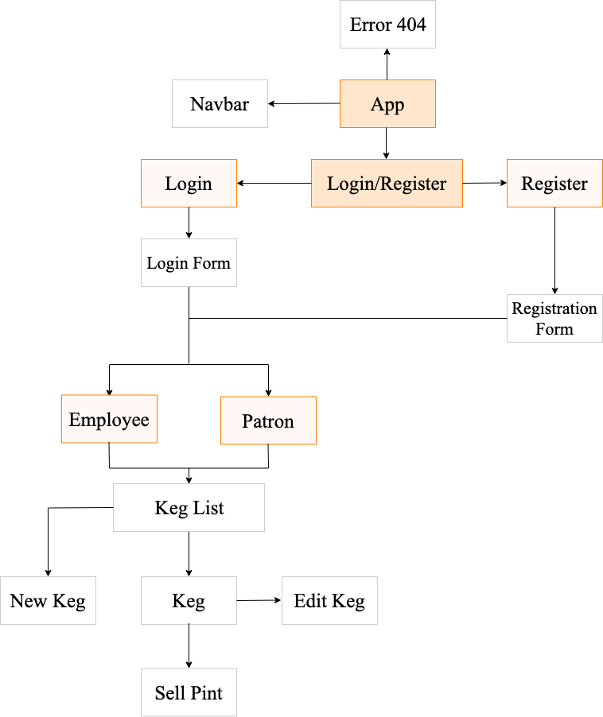

# Tap Room

#### Tap Room is a web application for a tap room employees and management.

#### By _**Svitlana Filatova**_

This project was bootstrapped with [Create React App](https://github.com/facebook/create-react-app).

## Description

| User Stories                                                                                                                         |
| ------------------------------------------------------------------------------------------------------------------------------------ |
| As a patron, I want to see a list/menu of all available kegs. For each keg, I need to see its name, brand, price and alcoholContent. |
| As a patron and/or employee, I want to see how many pints are left in a keg.                                                         |
| As a patron, I want to use price property to display premium beers differently than budget beers.                                    |
| As a patron, I want to use the alcohol content property to display stronger beers differently than weaker beers.                     |
| As an employee, I want to fill out a form when I tap a new keg to add it to the list.                                                |
| As an employee, I want the option to edit a keg's properties after entering them just in case I make a mistake.                      |
| As an employee, I want to be able to click a button next to a keg whenever I sell a pint of it.                                      |
| As an employee, I want to be able to see kegs with less than 10 pints left so I can be ready to change them.                         |

## App Components Structure

## Setup/Installation Requirements

- _Clone this repository on your Desktop._
- _Open Terminal (for Mac users) or PowerShell (for Windows users), navigate to react-taproom folder(cd .../Desktop/react-taproom) and run the following command: npm i. After installing all packages run npm start._
- _Now run npm start and open a localhost:3000 in your browser._

## Known Bugs / Limitations

- _No bugs found at the moment._
- _Registration/Login is not implemented yet._
- _New keg and Edit keg forms are not implemented yet._

## Support and contact details

_Contact Svitlana Filatova at svitlana.filatova@gmail.com._

## Technologies Used

_React, React-Router, Javascript, Webpack, Babel, CSS, Bootstrap._

### License

_This software (sans images) is licensed under the MIT license._

Copyright (c) 2019 **_Svitlana Filatova_**
